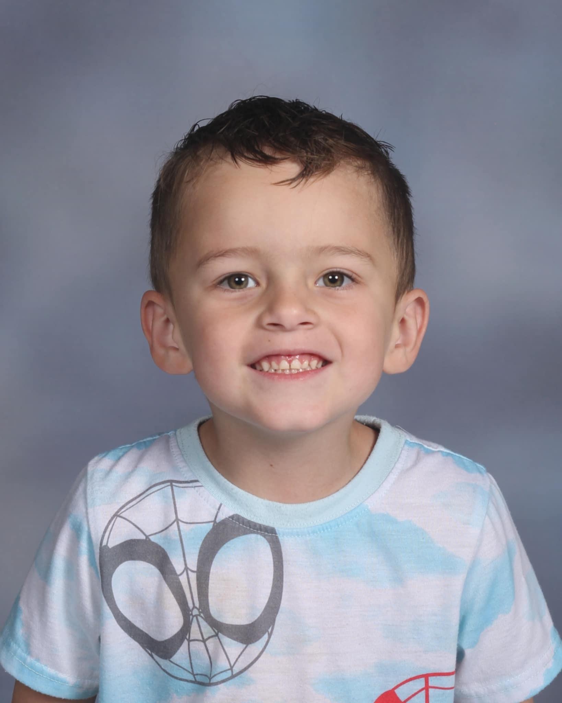
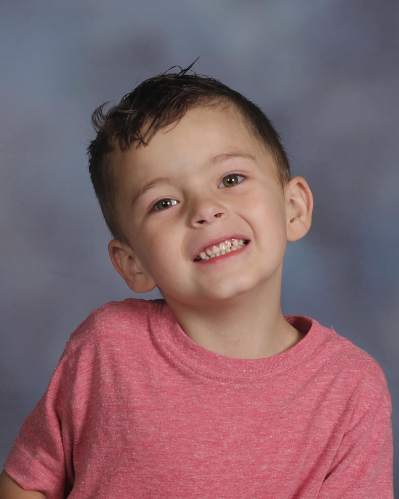
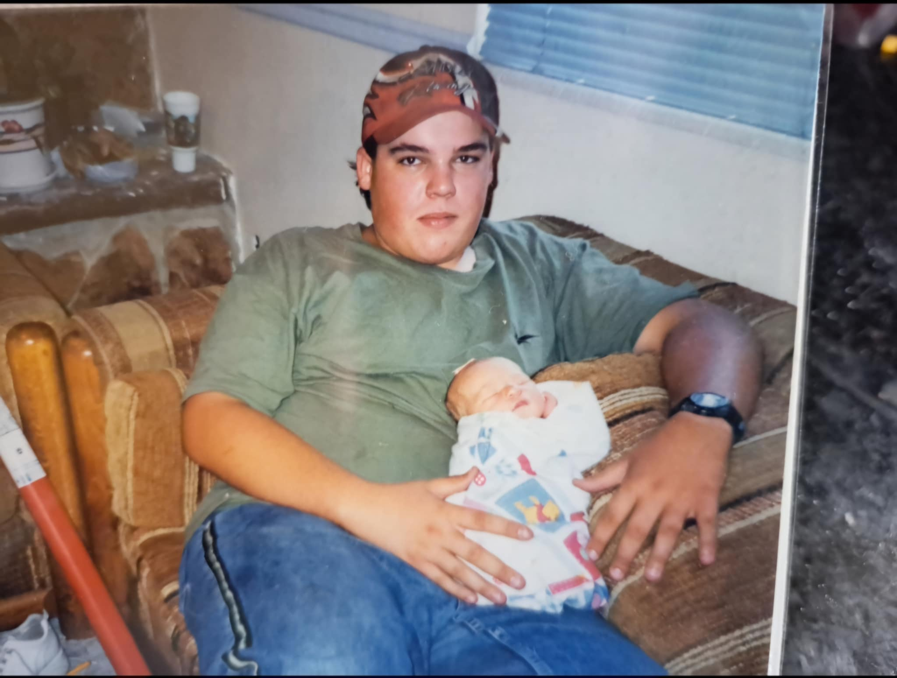
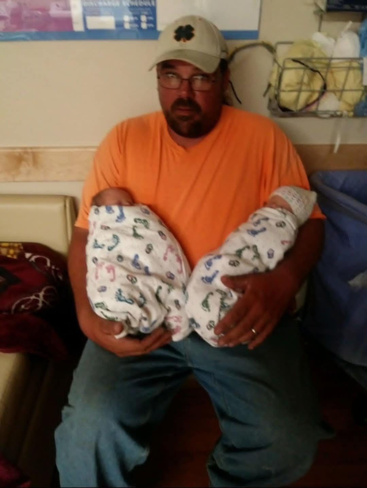

Heres all about me School has always been really hard for me, when I started 11th grade I only had 6 cerdits, I did packets to get my cerdit up and graduated early my senior year.  I became a mother at 18 with Twin Boys and again at 20 to another Baby Boy

<!DOCTYPE html>
<html lang="en">
 <head>
    <meta charset="UTF-8">
    <meta name="viewport" content="width=device-width, initial-scale=1.0">
    <title>Shaylyn's Portfolio</title>
    <link rel="stylesheet" href="styles.css"
 </head>
 <body> 
    <header class="centerHeader"> 
        <h1>Shaylyn Whitman</h1>
        

            
        
      
    </header>

    <nav class="nav"> 
            <a href="skills.html">Skills</a>
            <a href="experience.html">Experience</a>
            <a href="concactme.html">Contact Me</a>
        </nav> 

    

    <main>
        <section>
            <h2>About Me</h2>
            
 Here's all about me! My life was hard growing up and there was a lot of challenges but I got through it. I graduated at 17 and I was the first in my family to graduate. My mom got me a graduation present and that's is my cat ButterCup. I'm a single mom of 3 boys and just living day by day and I noticed that I was taking pictures a lot more and I just love doing it. 

                  
        </section>
        
        <section>
            <h2>Skills</h2>
            <h3>Here's My List of Skills</h3>
            <ol>
                <li>Organization</li>
                <li>Multi Tasking</li>
                <li>Stressful Situation's</li>
            </ol>
        </section>
        
        <section>
            <h2>Work Experience</h2>
            <ul>
                <li>Mother
                    <ul>
                        <li>I've been a mother since 2019 and it's been really hard. Thank you to my family for helping.</li>
                    </ul>
                </li>
                <li>MegaPlex
                    <ul>
                        <li>I've never been able to keep a job, This one was the first job I stayed at for over a year and I was so proud of myself.</li>
                    </ul>
                </li>
            </ul>
        </section>

        <section>
          <h2>My Father</h2>
            
 Here's some background of what has happened. My Father went to work on the 29th and decided that he couldn't do work that day and went back home,
              When he got home my mother noticed that something was wrong and got my dad inside and on his oxygen and she checked his oxygen and it was at 65 and his heart rate was at 175.
              She told him to get in the car or she was going to call the ambulance, he decided to get in the car and they went to the hospital,
              The doctors didn't know how he walked in, that's how bad it was. He got admitted to the ICU and they knew that was an infection but couldn't figure out where it was.
              He was transferred to Utah Valley and they found out that the infection was in his left leg and they decided to amputate right above the knee and are doing dialysis to get the infection out.
              They've put a trach in and are trying to get him breathing on his own and he just got transferred to a Specialty Hospital.
              I saw him yesterday and he's doing good and he loves doing physical therapy. I heard his voice a little and it was the best thing to hear again. 

               
                
        </section>

        <section>
            <h2>Photo's</h2>
            
 Here's just some of my favorite picture's.

                      
        </section>
        
    </main>
    <footer class="leftfooter">
         <a href="https://gofund.me/55563c6e" target="_blank">GoFundMe</a>
         <a href="https://www.linkedin.com/in/shaylyn-whitman-443184321/" target="_blank">LinkedIn</a>
         <a href="https://www.instagram.com/whitmanshaylyn/" target="_blank">Instagram</a>
    </footer>

    

 </body>

</html>